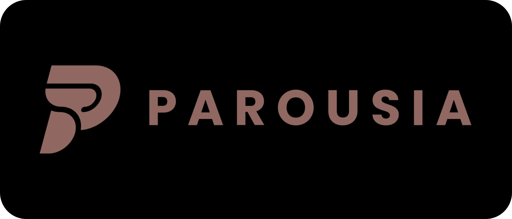

### **Your Rich Presence on Discord and beyond.**

## What is Parousia?

Parousia is an open-source Rich Presence platform that brings your browser activity to your favourite Rich Presence platform, starting with Discord.

Parousia consists of a lightweight browser extension and native desktop application, with no account or sign-in required.

## Features

- **Rich Presence** for supported websites and web applications
- **Activities** for native and PreMiD integrations
- **Local-first architecture** with browser-to-desktop communication over loopback
- **No account or sign-in required**
- **No analytics or telemetry**
- **Minimal permissions** with website access requested only when an Activity needs it
- **Discord integration** through the official local RPC interface
- **Cross-platform Desktop** support for Windows and Linux, with macOS planned
- **Developer-friendly Activity API** built with TypeScript
- **Lightweight native Desktop** application written in Rust

## Get Parousia

### Browser Extensions

| Browser  | Status    | Install                                                                                                |
| -------- | --------- | ------------------------------------------------------------------------------------------------------ |
| Chromium | Available | [Chrome Web Store](https://chromewebstore.google.com/detail/parousia/achhedhokopfgfnigkfchklhbebbhebd) |
| Firefox  | Available | [Mozilla Add-ons](https://addons.mozilla.org/en-US/firefox/addon/parousia/)                            |

### Desktop & Other Downloads

| Platform   | Status      | Download                                                   |
| ---------- | ----------- | ---------------------------------------------------------- |
| Windows    | Available   | [GitHub Releases](https://github.com/Abadima/RPC/releases) |
| Linux      | Available   | [GitHub Releases](https://github.com/Abadima/RPC/releases) |
| macOS      | Coming soon | —                                                          |
| Userscript | Available   | [GitHub Releases](https://github.com/Abadima/RPC/releases) |
|            |

## Activity Ecosystem

Activities are maintained separately from the core Parousia repository and use a shared Activity API.

**[parousia-project/activities](https://github.com/parousia-project/activities)**

**[premid/activities](https://github.com/premid/activities)**

Activities are organized by website and can provide their own settings, page data requirements, site access, Discord applications, and Rich Presence details.

Parousia currently includes the native Activity ecosystem alongside a large selection of compatible PreMiD Activities.

## Documentation

Full documentation covering installation, configuration, Activities, compatibility, privacy, security, and development is available at:

**[parousia.abadima.dev](https://parousia.abadima.dev)** (Maintained in **[parousia-project/website](https://github.com/parousia-project/website)**)

## Roadmap

See [`project/roadmap.md`](project/roadmap.md) for the current roadmap.

## Technology

- **Desktop:** Rust
- **Browser & Activities:** TypeScript
- **Browser:** Chromium, Firefox, and userscript builds
- **Platforms:** Discord; Fluxer once it offers Rich Presence to other apps
- **Architecture:** Local browser-to-desktop WebSocket with native platform adapters

## Contributing

Contributions, issues, and discussions are welcome.

See [`CONTRIBUTING.md`](.github/CONTRIBUTING.md) to get started.

Security vulnerabilities should be reported privately according to [`SECURITY.md`](.github/SECURITY.md).

## License

Parousia is licensed under the [Apache License 2.0](LICENSE).

The repository also contains third-party components under their respective licenses, including PreMiD Activities under the Mozilla Public License 2.0, a font under the SIL Open Font License, and icons under CC BY 4.0.

Each extension release includes `THIRD-PARTY-NOTICES.txt`, and Desktop releases include `parousia-desktop-notices.txt` for statically linked Rust dependencies.
