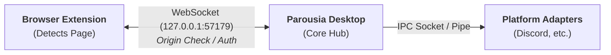

# Parousia Architecture Overview

Parousia consists of four modular components: **Browser Extension**, **Parousia Desktop**, **Platform Adapters**, and **Activities**.

---

## 1. Core Architecture



- **Browser Extension**: Observes tabs, executes matchers, and produces platform-agnostic `Activity`/`Presence` payloads (`browser/src/core/`).
- **Parousia Desktop**: Native Rust application serving as the local hub. Validates, bounds, and routes generic `Presence` updates to platform adapters.
- **Platform Adapters**: Translate generic `Presence` objects into native platform Rich Presence protocols (`desktop/src/adapters/`).
- **Activities**: Detection logic (URL matchers + page parsers). Supports native Activities and PreMiD ecosystem compatibility.

---

## 2. Activity System

Activities are compiled at build time from two external repositories (`browser/activity-sources.json`); no remote code is loaded at runtime (MV3 compliant).

- **Native Activities** (`parousia-project/activities`): Read URLs/titles or use Parousia's built-in `collector.ts` to poll Media Session (`<video>`/`<audio>`) data without injecting script code into pages.
- **PreMiD Activities** (`PreMiD/Activities`): Compiled via Bun into isolated sandboxes. Runtime strips `chrome.storage` APIs (`withholdStorage`), enforces strict execution bounds, and scrubs non-permitted fields (`limitPageData`).
- **Display fields**: An Activity can carry a type (playing, listening, watching, competing), the status line Discord shows, a party size, and links on its images; PreMiD Activities and native ones (`type`, `statusDisplayType`) set them, and Desktop's Discord adapter sends them.
- **Languages**: The popup and dashboard are translated into German, French, Japanese, Romanian, Russian, Swedish, and Simplified Chinese (`browser/src/core/i18n.ts`, `browser/src/locales/`; the browsers' own `_locales` were weighed and not adopted, see `browser/README.md`, Languages); Activities' own text is not, except PreMiD's descriptions, which come in the languages PreMiD's metadata has.
- **Site access**: A PreMiD Activity runs where its `regExp` matches, so the sites it asks access for come from the `regExp` too (`originsFor` in `scripts/activities/premid.ts`): `*://*.host/*` where it takes any subdomain, `www.` where it takes that, the host as named otherwise.
- **Pipeline & Matching**: Shared discovery (`websites/<letter>/<Name>/`), single manifest format (`manifest.ts`), unified settings framework, and deterministic ordering (`activities/catalog.json`).

---

## 3. Communication Protocol

- **Transport**: WebSocket server on `ws://127.0.0.1:57179/ws`. Max frame size: 16 KiB. Desktop reads each request head once and does the RFC 6455 upgrade itself (`desktop/src/link/http.rs`); tungstenite runs the WebSocket after that.
- **Authentication & Access Control**:
- **Chromium Extensions**: Verified via hardcoded Chrome Web Store ID or explicit `allowedOrigins`.
- **Firefox Extensions**: `moz-extension://<uuid>` verified against `allowedOrigins` (prompted on first run).
- **Userscripts**: Disabled by default. Checked via `Origin` verification.
- **Linux Security**: Checks process ownership in `/proc/net/tcp` to drop connections from other OS users.

- **Versions**: `hello` carries the client's release version and a protocol number, and `welcome` carries Desktop's release version. Only a different major version, or a different protocol number, stops the link (`unsupported_version`; the popup says "Versions don't match"). Minor, patch, and beta differences keep working: the wire only gains optional fields within a protocol, and a Presence ignores fields it doesn't know. The extension compares the numbers and, when one side is behind, shows a "newer version available" notice (with the download for Desktop, and a "Not now" that's remembered for that pair of versions) instead of blocking. The protocol number is raised only when an older peer could no longer read the wire, which also means a new major release.
- **Lifecycle**: The browser disconnects 30 seconds after activity clears. Event pages stay alive via `runtime.getPlatformInfo()` every 20s during active sharing.

---

## 4. Platform Adapters

Adapters implement the `PlatformAdapter` Rust trait:

```rust
pub trait PlatformAdapter: Send + Sync {
    fn platform(&self) -> Platform;
    fn show(&self, activity: Option<Activity>);
    fn status(&self) -> AdapterStatus;
}

```

- **Discord Adapter**: Talks directly to local Discord IPC sockets/pipes (`discord-ipc-0..9`).
- **Coalescing**: The Hub wraps every adapter in `adapters/coalesce.rs`, so all platforms share it. Another Activity (or Discord Application), or clearing, goes through at once and discards anything waiting, so a platform never shows an Activity the Hub has moved on from. An update within the Activity already showing (same `id` and Discord Application) also goes through at once, unless the adapter was told something less than 2 seconds ago; then the newest such update waits for that time to end, and a newer one replaces it without moving the time. The first change after a calm spell is never delayed, a burst shows its first and its last, and a continuous stream is at most 2 seconds behind (a trailing debounce would starve it). One short-lived thread exists only while an update waits; there is no polling. It does not model any platform's rate limit.
- **Rate Limiting**: The Discord adapter also keeps to Discord's 5 requests per 20 seconds, sending only the latest once the window allows.
- **Validation**: Truncates text fields (2–127 chars), limits asset URLs (256 chars), and enforces button bounds.
- **Dynamic Applications**: Reconnects dynamically per-activity `discordClientId`.
- **Transports**: A Unix socket on Linux and macOS, an overlapped named pipe on Windows. Both are checked to belong to this OS user, and a reader notices Discord quitting at once.
- **Large image**: Without a large image Discord shows the Application's own icon, which for most Activities is Parousia's logo. So the runtime (`browser/src/core/site-image.ts`) makes sure every detected Activity has one Discord can show: its own (an `https` address within 256 characters, or an asset key), otherwise the website's logo (the Activity's `icon`), otherwise the tab's favicon (`https`, no query string, not `.ico` or `.svg`), and only then none, so Parousia's logo appears only where the site has no usable image. The Default Activity is a person's own choice and isn't given one.

---

## 5. Security Model

- **Zero-Trust Boundaries**: Content scripts and third-party PreMiD scripts are fully untrusted. Background pages reject unexpected origins and non-extension ports.
- **Granular Site Access**: Page-reading Activities require explicit runtime site permissions (`optional_host_permissions`). Users can toggle shared telemetry tiers (`media`, `thumbnails`, `creatorIcons`) in Settings.
- **Minimal Privileges**: No remote code execution. Dependencies are continuously audited via Dependabot, CodeQL, and `cargo audit`.

---

## 6. Compatibility & Alternative Routes

- **Discord-RPC-Extension**: Parousia's extension can communicate directly with `Discord-RPC-Extension` via `chrome.runtime.sendMessage` or its direct desktop fallback (`127.0.0.1:6969`), enabling Rich Presence without Parousia Desktop installed.
- **MAL-Sync**: MAL-Sync recognizes anime and manga pages and answers Discord-RPC-Extension's cross-extension presence requests. With it turned on (Settings > Platforms, off by default), Parousia sends the same request, with only a tab number, for the tab it shares (`browser/src/compat/malsync.ts`), parses the reply like a PreMiD Activity's, and offers it to the runtime as an external Activity that takes the page over (`RuntimeOptions.external`). From there it follows the usual path: Settings > Privacy limits, then Parousia Desktop, or Discord-RPC-Extension's app when Desktop isn't connected. Nothing is asked while it's off or there's no http(s) tab to share, and on a page MAL-Sync has nothing for it's asked three more times and then left alone. See `project/compatibility.md`.
- **Headless / No-Tray**: Desktop can operate entirely headless (`--headless`) or through CLI commands (`Parousia-Desktop status|set|allow|disallow`). Native OS trays exist for Linux (custom D-Bus SNI, on a session bus only if this user runs it) and Windows (Win32, with Start at login). The CLI uses a socket in a private directory on Linux and macOS, with a lock beside it as the single-instance check, and on Windows a named pipe only this user can open, which is also its single-instance check.
